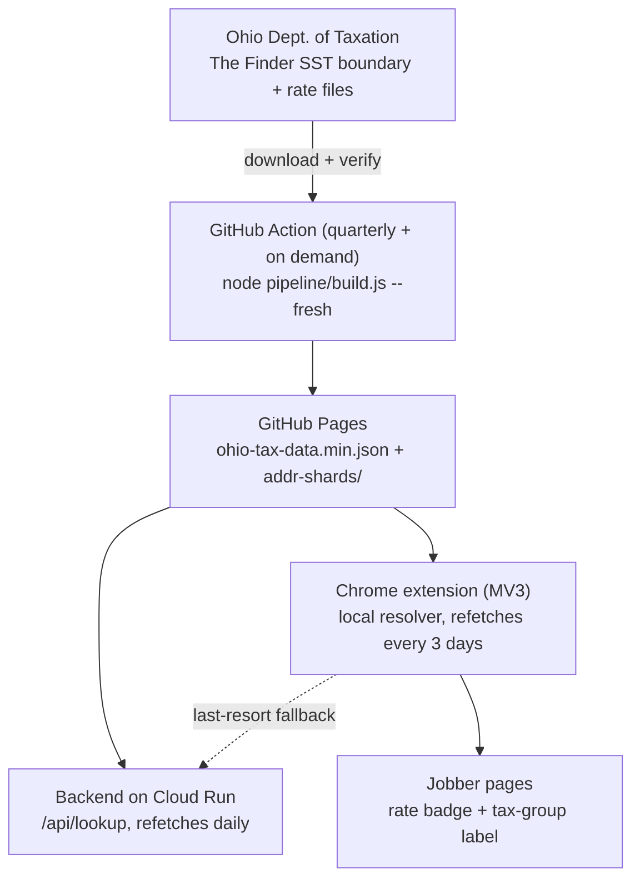

# steambrite-tax

[](https://github.com/jefe2332/steambrite-tax/actions/workflows/refresh-data.yml)

**Street-address-accurate Ohio sales-tax rates, built entirely from the state's official data. No paid APIs, no API keys, and zero recurring maintenance.**

A Chrome extension surfaces the right rate (and the matching accounting label) directly inside [Jobber](https://getjobber.com), backed by a Cloud Run API and a data pipeline that rebuilds itself every quarter via GitHub Actions.

## Why this exists

Most "free sales tax" data is a per-ZIP estimate, and in Ohio that approach is structurally wrong. Ohio levies sales tax by **county plus transit district** (COTA, TARTA, MVRTA, and others), and ZIP codes routinely straddle those boundaries:

- ZIP **43082** (Westerville) contains three different jurisdictions: Delaware County (7.00%), Delaware-inside-COTA (8.00%), and Franklin-inside-COTA (8.00%).
- ZIP **43068** (Reynoldsburg) spans rates from 7.25% to **8.25%**, so a ZIP-blended table quietly overcharges or undercharges most of it.

The fix: Ohio publishes the exact answer for free. The Department of Taxation's [**The Finder**](https://thefinder.tax.ohio.gov/) distributes Streamlined Sales Tax boundary and rate files: per-ZIP, per-ZIP+4, and **per-street-address-range** jurisdiction records. This repo compiles those files into a compact lookup and puts it everywhere it's needed.

## How a lookup resolves

```
ZIP5 unambiguous ──────────────────────────────► exact
ZIP5 ambiguous ─► ZIP+4 range match ───────────► exact
               ─► street address-range match ──► exact
               ─► street known in this ZIP ────► ZIP default (exact)
               ─► unknown street ─► Census geocoder, but only trusted
                                    if it echoes the same ZIP ───► high
               ─► anything else ───────────────► ZIP default (verify)
```

Every response carries a confidence level, and "verify" answers link straight to The Finder so a human can confirm a boundary case in seconds. The Census geocoder guard exists because fuzzy geocoders love to snap nonexistent addresses onto the wrong side of a county line, a failure mode this stack was specifically tested against.

## Architecture



Both consumers ship with a bundled data snapshot, so they work offline on day one and degrade gracefully if the hosted copy is ever unreachable. Ohio only changes rates on quarter boundaries (Jan/Apr/Jul/Oct 1); the Action runs on the 2nd, so the fleet is never more than a few days behind a change, with no human in the loop.

## What's in the repo

| Path | What it is |
|---|---|
| [`pipeline/`](pipeline/) | Downloads and parses the state's 1.9M-row boundary file into a 1.5 MB lookup (ZIP5/ZIP+4 tables + 556 per-ZIP street shards), then **verifies all 88 county totals against the state's own published rate report** before anything ships. |
| [`extension/`](extension/) | Manifest V3 Chrome extension. Scans Jobber pages for addresses (React-controlled forms included), resolves rates locally in a service worker, and injects a suggested-tax badge with the matching Jobber tax-group name. 134 unit tests, no dependencies, no build step. |
| [`backend/`](backend/) | Express server for Cloud Run. Same resolver, same data; serves `/api/lookup` as the extension's last-resort fallback and a standalone web calculator. |
| [`docs/`](docs/) | [Operator setup runbook](docs/SETUP.md) for deployment and team rollout. |
| [`.github/workflows/`](.github/workflows/) | The quarterly self-refresh: rebuild, verify, publish to Pages. |

## Data quality

- Source: Ohio DoT's Streamlined Sales Tax boundary and rate files, the same dataset the state's own lookup runs on. Under the SST agreement, sellers relying on these files receive [liability relief for rate errors](https://www.streamlinedsalestax.org/Shared-Pages/rate-and-boundary-files).
- Every build cross-checks all 88 computed county totals (including COTA/TARTA split districts) against the state's independently published county rate report and fails loudly on any mismatch.
- Verification history and methodology: [`pipeline/README.md`](pipeline/README.md).

*This project distributes public government data as-is. It is not tax advice; confirm edge cases with [The Finder](https://thefinder.tax.ohio.gov/) or a tax professional.*

## Quick start

```bash
# Rebuild the dataset from the state's current files (needs curl + unzip)
cd pipeline && node build.js --fresh

# Run the API locally
cd backend && npm install && npm run dev   # http://localhost:3000

# Run the test suites (plain node, no framework)
node extension/tests/resolver.test.js
node extension/tests/scanner.test.js
```

Load the extension unpacked from `extension/` via `chrome://extensions` with Developer mode on. Full deployment instructions (Pages hosting, Cloud Run continuous deploy, team rollout): [`docs/SETUP.md`](docs/SETUP.md).

---

Built for [Steambrite](https://steambrite.us), where carpet cleaning comes with correctly calculated sales tax.
